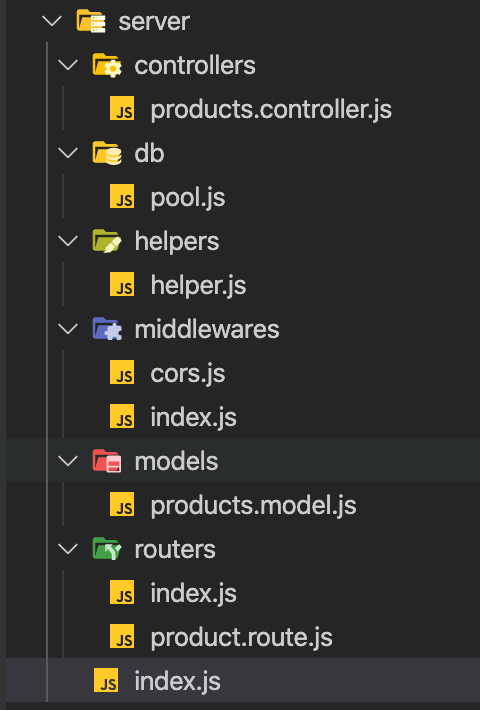

### Introduction

The backend is built using Express. It will use a Postgres database and use a pg library to make queries. It will use cors as a middleware for protection against attacks. It will use body-parser to parse request bodies, dotenv to protect environment variables and nodemon to watch for changes in the dev environment.

### Code Structure



It follows a simple modular and MVC pattern. `index.js` is the main entry point which is responsible to start the server.
We use `express` for building API in this tutorial.

The routes are registered in the `routes\index.js` and similarly the middlewares are registered in `middlewares\index.js`.

`db\pool.js` is responsible for creating the PostgreSQL database pool/connection using the database information sourced via the environment variables.

### Local development

1. **Install Dependencies**  - Execute `npm install` in the project root to download all the dependencies needed to run the code.

2. There are 2 API routes that are exposed
    - `/api/products` - This displays all the products from the postgresql database.
    - `/` - This returns OK and is used as health api for readiness probe.

3. **Run code locally** - Execute `npm run dev` to start the development server. 

> Note: Development server uses NodeMon which watches for files changes and restarts the server automatically.


### Building Docker Image

Once you are all set with your business logic and have ensured that the application is running well locally, it's time we build the docker image for the application which we will then use to deploy the kubernetes Pods.

The execution steps are outlined in the `Dockerfile`

```
FROM node:lts

WORKDIR /app

COPY . .
RUN npm install && npm run build

EXPOSE 8080

CMD npm start
```

Build Docker Image using following command:

`docker build -t {imageName}:{tag} .`  

e.g docker build -t ps-sales-backend:1.0 .


### Deploy changes to Kubernetes

Edit the `deployment.yaml` under deploy/  and edit the value for the `image` property within the containers section to match your {imageName}:{tag}

Once done , just execute the below command to deploy the changes:

 `kubectl apply -f deploy/deployment.yaml`