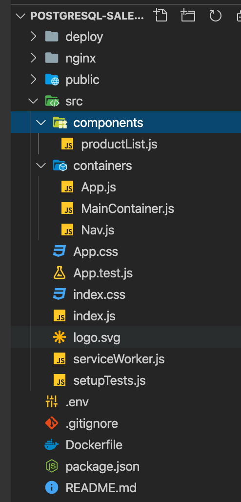

### Introduction

Frontend is built using ReactJS. React is basically a JavaScript library for building user interfaces. It is easy, efficient and painless way to create Interactive UIs. It is maintained by Facebook and a community of individual developers and companies. Design simple views for each state in your application, and React will efficiently update and render just the right components when your data changes and for this reason only, it is used for developing single-page application or mobile applications.

### Code Structure



### Building Docker Image

`docker build -t {imageName}:{tag} .`  

e.g docker build -t ps-sales-frontend:1.0 .

### Deploy changes to Kubernetes

Edit the `deployment.yaml` under deploy/  and edit the value for the `image` property within the containers section to match your {imageName}:{tag}

Once done , just execute the below command to deploy the changes:

 ```execute
 kubectl apply -f deploy/deployment.yaml
 kubectl apply -f deploy/service.yaml
 ```

### Check Pods and Services

```execute
kubectl get svc -n pgo
kubectl get pods -n pgo
```

### Access the Application

You can access the application using the IP Address and the NodePort that is configured in service.yaml

http://{ipAddress}:30455